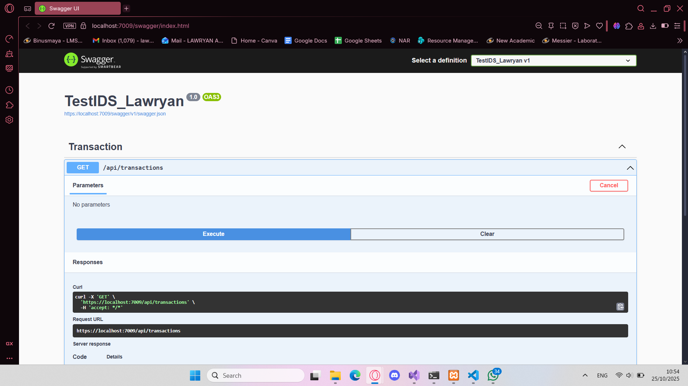

# Proyek API Tes (ASP.NET Core 6.0)

Ini adalah proyek Web API sederhana yang dibuat menggunakan ASP.NET Core 6.0. API ini terhubung ke database MySQL (dijalankan melalui XAMPP) dan menyajikan data transaksi dan status dalam format JSON yang telah ditentukan.

## Persyaratan

Pastikan Anda memiliki perangkat lunak berikut yang terinstal di komputer Anda:

* **Visual Studio 2022:** (Pastikan *workload* "ASP.NET and web development" terinstal).
* **.NET 6.0 SDK:** (Biasanya sudah termasuk dalam Visual Studio 2022).
* **XAMPP:** Digunakan untuk menjalankan server Apache dan database MySQL.

---

## Panduan Instalasi dan Setup

Ikuti langkah-langkah ini untuk menjalankan proyek secara lokal.

### 1. Dapatkan Proyek (Clone Repository)

1.  Buka terminal atau Command Prompt.
2.  Clone repositori ini ke komputer lokal Anda:
    ```bash
    git clone [URL_REPOSITORI_GITHUB_ANDA_DI_SINI]
    ```
3.  Masuk ke folder proyek dan buka file `.sln` (Solusi) dengan Visual Studio 2022.

### 2. Setup Database (XAMPP & MySQL)

Proyek ini memerlukan database MySQL untuk berjalan.

1.  Buka **XAMPP Control Panel** dan jalankan modul **Apache** dan **MySQL**.
2.  Buka browser Anda dan navigasi ke `http://localhost/phpmyadmin`.
3.  Buat database baru. Klik *tab* **Databases**, masukkan nama `database_transaction` di kolom *Create database*, dan klik **Create**.
4.  Klik database `database_transaction` yang baru saja Anda buat.
5.  Klik *tab* **SQL**.
6.  Salin dan jalankan kueri SQL dari query.sql untuk membuat tabel dan memasukkan data.


### 3. Konfigurasi Connection String

Proyek ini dikonfigurasi untuk terhubung ke database XAMPP default (`root` tanpa password).

1.  Buka file `appsettings.json` di Visual Studio.
2.  Kemudian buka file `appsettings.Development.json` dengan dropdown `appsettings.json`
3.  pastikan bagian `appsettings.Development.json` Anda terlihat seperti ini:

    ```json
    {
        "Logging": {
            "LogLevel": {
            "Default": "Information",
            "Microsoft.AspNetCore": "Warning"
            }
        },
        "AllowedHosts": "*",
        "ConnectionStrings": {
            "DefaultConnection": "Server=localhost;Database=database_transaction;User=root;Password=;"
        }
    }

    ```
3.  Jika instalasi XAMPP MySQL Anda menggunakan *password*, harap sesuaikan bagian `Password=;`.

### 4. Restore Paket NuGet

Visual Studio seharusnya melakukan ini secara otomatis saat Anda membuka proyek. Jika tidak, klik kanan pada *Solution* di *Solution Explorer* dan pilih **Restore NuGet Packages**.

---

## Menjalankan Proyek

1.  Di Visual Studio 2022, pastikan *startup profile* diatur ke nama proyek Anda (misal: `Project_API`).
2.  Tekan **F5** atau klik tombol *Run* (panah hijau).
3.  Proyek akan di-*build* dan dijalankan. Sebuah browser akan otomatis terbuka ke halaman **Swagger UI**.

---

## Cara Menggunakan API

1.  Setelah proyek berjalan, browser akan menampilkan halaman Swagger (misal: `https://localhost:7009/swagger/index.html`).
2.  Anda akan melihat satu *endpoint* terdaftar: `GET /api/transactions`.
3.  Klik pada *endpoint* tersebut untuk membukanya.
4.  Klik tombol **Try it out**.
5.  Klik tombol **Execute**.
6.  *Scroll* ke bawah ke bagian **Responses**. Jika semua berhasil, Anda akan melihat **Response body** dengan data JSON lengkap yang diambil dari database MySQL Anda, sesuai dengan format yang diinginkan.
(images/output2.png)